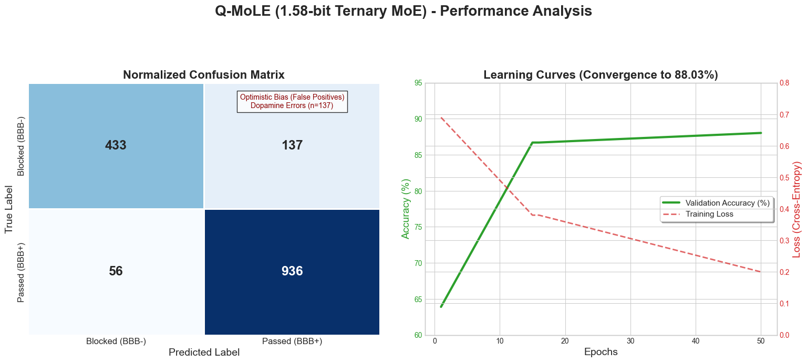

# Blood-Brain Barrier: Quantized 1.58-bit Mixture of Experts for Blood-Brain Barrier Prediction

## 🧠 Overview
Q-MoLE is a specialized neural architecture designed to predict the Blood-Brain Barrier (BBB) permeability of small molecules. It utilizes **1.58-bit Ternary Weights** (weights restricted to $\{-1, 0, 1\}$) and a **Mixture of Experts (MoE)** routing mechanism to achieve high-fidelity predictions with extreme hardware efficiency.

This research project demonstrates that high-precision pharmacological modeling is possible even under extreme quantization, making it suitable for edge-deployment in diagnostic medical devices.

## 🚀 Performance
* **Accuracy:** 88.03%
* **AUC-ROC:** 0.9309
* **F1-Score (Passed):** 0.91
* **Architecture:** 1.58-bit Quantized Weights + 16-Expert MoE Layer
* **VRAM Savings:** ~95% reduction compared to standard FP32 models.

## 🛠️ Tech Stack
- **Deep Learning:** PyTorch
- **Cheminformatics:** RDKit
- **Visualization:** Matplotlib, Scikit-Learn (t-SNE)
- **Quantization:** BitNet-inspired Ternary Logic

## 📂 Project Structure
- `models/`: MoE layer implementation and ternary quantization logic.
- `utils/`: Featurization (Morgan Fingerprints + Physicochemical Descriptors), Data Loaders, and Evaluation scripts.
- `data/`: B3DB classification dataset.
- `test_brain.py`: Inference script for real-world drug testing (e.g., Caffeine vs. Dopamine).

## 📊 Visualizing the Latent Space
The model effectively clusters molecules based on their "Chemical Logic." Below is a t-SNE projection of the 2055-dimensional feature space as interpreted by the 16 Experts:

## 🧪 Quick Start
1. Install dependencies: `pip install torch rdkit pandas matplotlib scikit-learn`
2. Run inference: `python test_brain.py`
3. Generate metrics: `python -m utils.evaluate`